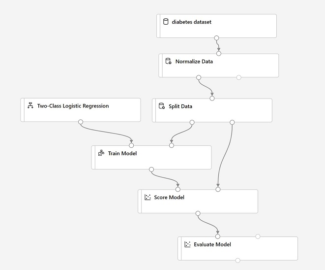

---
lab:
    title: 'Create an Azure Machine Learning workspace'
---

# Create and Explore an Azure Machine Learning Workspace

In this exercise, you will create and explore an Azure Machine Learning workspace.

## Create an Azure Machine Learning workspace

As its name suggests, a workspace is a centralized place to manage all of the Azure ML assets you need to work on a machine learning project.

1. In the [Azure portal](https://portal.azure.com), create a new **Machine Learning** resource, specifying the following settings:

    - **Subscription**: *Your Azure subscription*
    - **Resource group**: `rg-dp100-labs`
    - **Workspace name**: `mlw-dp100-labs`
    - **Region**: *Select the geographical region closest to you*
    - **Storage account**: *Note the default new storage account that will be created for your workspace*
    - **Key vault**: *Note the default new key vault that will be created for your workspace*
    - **Application insights**: *Note the default new application insights resource that will be created for your workspace*
    - **Container registry**: None (*one will be created automatically the first time you deploy a model to a container*)

    > **Note**: When you create an Azure Machine Learning workspace, you can use some advanced options to restrict access through a *private endpoint* and specify custom keys for data encryption. We won't use these options in this exercise - but you should be aware of them!

2. When the workspace and its associated resources have been created, view the workspace in the portal.

## Explore Azure Machine Learning studio

You can manage some workspace assets in the Azure portal, but for data scientists, this tool contains lots of irrelevant information and links that relate to managing general Azure resources. *Azure Machine Learning studio* provides a dedicated web portal for working with your workspace.

1. In the Azure portal blade for your Azure Machine Learning workspace, click the link to launch studio; or alternatively, in a new browser tab, open [https://ml.azure.com](https://ml.azure.com). If prompted, sign in using the Microsoft account you used in the previous task and select your Azure subscription and workspace.

    > **Tip** If you have multiple Azure subscriptions, you need to choose the Azure *directory* in which the subscription is defined; then choose the subscription, and finally choose the workspace.

2. View the Azure Machine Learning studio interface for your workspace - you can manage all of the assets in your workspace from here.
3. In Azure Machine Learning studio, toggle the &#9776; icon at the top left to show and hide the various pages in the interface. You can use these pages to manage the resources in your workspace.

## Create a compute instance

One of the benefits of Azure Machine Learning is the ability to create cloud-based compute on which you can run experiments and training scripts at scale.

1. In Azure Machine Learning studio, view the **Compute** page. This is where you'll manage compute resources for your data science activities. There are four kinds of compute resource you can create:
    - **Compute instances**: Development workstations that data scientists can use to work with data and models.
    - **Compute clusters**: Scalable clusters of virtual machines for on-demand processing of experiment code.
    - **Inference clusters**: Deployment targets for predictive services that use your trained models.
    - **Attached compute**: Links to other Azure compute resources, such as Virtual Machines or Azure Databricks clusters.

    For this exercise, you'll create a compute instance so you can run some code in your workspace.

2. On the **Compute instances** tab, add a new compute instance with the following settings. You'll use this as a workstation to run code in notebooks.
    - **Compute name**: *enter a unique name*
    - **Location**: *The same location as your workspace*
    - **Virtual machine type**: CPU
    - **Virtual machine size**: Standard_DS11_v2
    - **Total Available Quotas**: This shows dedicated cores available.
    - **Show advanced settings**: Note the following settings, but do not select them:
        - **Enable SSH access**: Unselected *(you can use this to enable direct access to the virtual machine using an SSH client)*
        - **Enable virtual network**: Unselected *(you would typically use this in an enterprise environment to enhance network security)*
        - **Assign to another user**: Unselected *(you can use this to assign a compute instance to a data scientist)*
        - **Provision with setup script**: Unselected *(you can use this to add a script to run on the remote instance when created)*

3. Wait for the compute instance to start and its state to change to **Running**.

> **Note**:
> Compute instances and clusters are based on standard Azure virtual machine images. For this exercise, the *Standard_DS11_v2* image is recommended to achieve the optimal balance of cost and performance. If your subscription has a quota that does not include this image, choose an alternative image; but bear in mind that a larger image may incur higher cost and a smaller image may not be sufficient to complete the tasks. Alternatively, ask your Azure administrator to extend your quota.

## Clone and run a notebook

A lot of data science and machine learning experimentation is performed by running code in *notebooks*. Your compute instance includes fully featured Python notebook environments (*Jupyter* and *JupyterLab*) that you can use for extensive work; but for basic notebook editing, you can use the built-in **Notebooks** page in Azure Machine learning studio.

1. In Azure Machine Learning studio, view the **Notebooks** page.
2. If a message describing new features is displayed, close it.
3. Select **Terminal** or the **Open terminal** icon to open a terminal, and ensure that its **Compute** is set to your compute instance and that the current path is the **/users/your-user-name** folder.
4. Enter the following command to clone a Git repository containing notebooks, data, and other files to your workspace:

    ```bash
    git clone https://github.com/MicrosoftLearning/mslearn-dp100 mslearn-dp100
    ```

5. When the command has completed, in the **Files** pane, click **&#8635;** to refresh the view and verify that a new **/users/*your-user-name*/mslearn-dp100** folder has been created. This folder contains multiple **.ipynb** notebook files.
6. Close the terminal pane, terminating the session.
7. In the **/users/*your-user-name*/mslearn-dp100** folder, open the **Get Started with Notebooks** notebook. Then read the notes and follow the instructions it contains.

> **Tip**: To run a code cell, select the cell you want to run and then use the **&#9655;** button to run it.

> **New to Python?** Use the [Python cheat sheet](cheat-sheets/dp100-cheat-sheet-python.pdf) to understand the code.

> **New to machine learning?** Use the [machine learning overview](cheat-sheets/dp100-cheat-sheet-machine-learning.pdf) to get a simplified overview of the machine learning process in Azure Machine Learning.


# Use Automated Machine Learning

Azure Machine Learning includes an *automated machine learning* capability that leverages the scalability of cloud compute to automatically try multiple pre-processing techniques and model-training algorithms in parallel to find the best performing supervised machine learning model for your data.

In this exercise, you'll use the visual interface for automated machine learning in Azure Machine Learning studio

> **Note**: You can also use automated machine learning through the Azure Machine Learning SDK.

## Configure compute resources

To use automated machine learning, you require compute on which to run the model training experiment.

1. Sign into [Azure Machine Learning studio](https://ml.azure.com?azure-portal=true) with the Microsoft credentials associated with your Azure subscription, and select your Azure Machine Learning workspace.
2. In Azure Machine Learning studio, view the **Compute** page; and on the **Compute instances** tab, start your compute instance if it is not already running. You will use this compute instance to test your trained model.
3. While the compute instance is starting, switch to the **Compute clusters** tab, and add a new compute cluster with the following settings. You'll run the automated machine learning experiment on this cluster to take advantage of the ability to distribute the training runs across multiple compute nodes:
    - **Location**: *The same location as your workspace*
    - **Virtual Machine tier**: Dedicated
    - **Virtual Machine type**: CPU
    - **Virtual Machine size**: Standard_DS11_v2
    - **Compute name**: *enter a unique name*
    - **Minimum number of nodes**: 0
    - **Maximum number of nodes**: 2
    - **Idle seconds before scale down**: 120
    - **Enable SSH access**: Unselected

## Create a dataset

Now that you have some compute resources that you can use to process data, you'll need a way to store and ingest the data to be processed.

1. View the comma-separated data at https://aka.ms/diabetes-data in your web browser. Then save this as a local file named **diabetes.csv** (it doesn't matter where you save it).
2. In Azure Machine Learning studio, view the **Data** page. Datasets represent specific data files or tables that you plan to work with in Azure ML.
3. Create a new dataset from local files, using the following settings:
    * **Basic Info**:
        * **Name**: diabetes-dataset
        * **Dataset type**: Tabular
        * **Description**: Diabetes data
    * **Datastore and file selection**:
        * **Select or create a datastore**: Currently selected datastore
        * **Select files for your dataset**: Browse to the **diabetes.csv** file you downloaded.
        * **Upload path**: *Leave the default selection*
        * **Skip data validation**: Not selected
    * **Settings and preview**:
        * **File format**: Delimited
        * **Delimiter**: Comma
        * **Encoding**: UTF-8
        * **Column headers**: Only first file has headers
        * **Skip rows**: None
    * **Schema**:
        * Include all columns other than **Path**
        * Review the automatically detected types
    * **Confirm details**:
        * Do not profile the dataset after creation
4. After the dataset has been created, open it and view the **Explore** page to see a sample of the data. This data represents details from patients who have been tested for diabetes, and you will use it to train a model that predicts the likelihood of a patient testing positive for diabetes based on clinical measurements.

    > **Note**: You can optionally generate a *profile* of the dataset to see more statistical details.

## Run an automated machine learning experiment

In Azure Machine Learning, operations that you run are called *experiments*. Follow the steps below to run an experiment that uses automated machine learning to train a classification model that predicts diabetes diagnoses.

1. In Azure Machine Learning studio, view the **Automated ML** page (under **Author**).
2. Create a new Automated ML run with the following settings:
    - **Select dataset**:
        - **Dataset**: diabetes dataset
    - **Configure run**:
        - **New experiment name**: mslearn-automl-diabetes
        - **Target column**: Diabetic (*this is the label the model will be trained to predict)*
        - **Select compute type**: Compute cluster
        - **Select Azure ML compute cluster**: *the compute cluster you created previously*
    - **Task type and settings**:
        - **Task type**: Classification
        - Select **View additional configuration settings** to open **Additional configurations**:
            - **Primary metric**: Select **AUC Weighted** *(more about this metric later!)*
            - **Explain best model**: Selected - *this option causes automated machine learning to calculate feature importance for the best model; making it possible to determine the influence of each feature on the predicted label.*
            - **Use all supported models**: <u>Un</u>selected - we'll restrict the experiment to try a few specific algorithms.
            - **Allowed models**: Select only **LogisticRegression** and **RandomForest**. These will be the only algorithms tried in the experiment.
            - **Exit criterion**:
                - **Training job time (hours)**: 0.5 - *this causes the experiment to end after a maximum of 30 minutes.*
                - **Metric score threshold**: 0.90 - *this causes the experiment to end if a model achieves a weighted AUC metric of 90% or higher.*
        - Select **View featurization settings** to open **Featurization**:
            - **Enable featurization**: Selected - *this causes Azure Machine Learning to automatically preprocess the features before training.*
    - **Select the validation and test type**:
        - **Validation type**: Train-validation split
        - **Percentage validation of data**: 30
        - **Test dataset**: No test dataset required

3. When you finish submitting the automated ML run details, it will start automatically. You can observe the status of the run in the **Properties** pane.
4. When the run status changes to *Running*, view the **Models** tab and observe as each possible combination of training algorithm and pre-processing steps is tried and the performance of the resulting model is evaluated. The page will automatically refresh periodically, but you can also select **&#8635; Refresh**. It may take ten minutes or so before models start to appear, as the cluster nodes need to be initialized and the data featurization process completed before training can begin. Now might be a good time for a coffee break!
5. Wait for the experiment to finish.

## Review the best model

After the experiment has finished; you can review the best performing model that was generated (note that in this case, we used exit criteria to stop the experiment - so the "best" model found by the experiment may not be the best possible model, just the best one found within the time and metric constraints allowed for this exercise!).

1. On the **Overview** tab of the automated machine learning run, note the best model summary.
2. Select the **Algorithm name** for the best model to view the child-run that produced it.

    The best model is identified based on the evaluation metric you specified (*AUC_Weighted*). To calculate this metric, the training process used some of the data to train the model, and applied a technique called *cross-validation* to iteratively test the trained model with data it wasn't trained with and compare the predicted value with the actual known value. From these comparisons, a *confusion matrix* of true-positives, false-positives,true-negatives, and false-negatives is tabulated and additional classification metrics calculated - including a Receiving Operator Curve (ROC) chart that compares the True-Positive rate and False-Positive rate. The area under this curve (AUC) us a common metric used to evaluate classification performance.
3. Next to the *AUC_Weighted* value, select **View all other metrics** to see values of other possible evaluation metrics for a classification model.
4. Select the **Metrics** tab and review the performance metrics you can view for the model. These include a **confusion_matrix** visualization showing the confusion matrix for the validated model, and an **accuracy_table** visualization that includes the ROC chart.
5. Select the **Explanations** tab, select an **Explanation ID**, and then view the **Aggregate Importance** page. This shows the extent to which each feature in the dataset influences the label prediction.

## Deploy a predictive service

After you've used automated machine learning to train some models, you can deploy the best performing model as a service for client applications to use.

> **Note**: In Azure Machine Learning, you can deploy a service as an Azure Container Instances (ACI) or to an Azure Kubernetes Service (AKS) cluster. For production scenarios, an AKS deployment is recommended, for which you must create an *inference cluster* compute target. In this exercise, you'll use an ACI service, which is a suitable deployment target for testing, and does not require you to create an inference cluster.

1. Select the **Overview** tab for the run that produced the best model.
2. From the **Deploy** option, use the **Deploy to web service** button to deploy the model with the following settings:
    - **Name**: auto-predict-diabetes
    - **Description**: Predict diabetes
    - **Compute type**: Azure Container Instance
    - **Enable authentication**: Selected
    - **Use custom deployment assets**: Unselected
3. Wait for the deployment to start - this may take a few seconds. Then, on the **Model** tab, in the **Model summary** section, observe the **Deploy status** for the **auto-predict-diabetes** service, which should be **Running**. Wait for this status to change to **Successful**. You may need to select **&#8635; Refresh** periodically.  **NOTE** This can take a while - be patient!
4. In Azure Machine Learning studio, view the **Endpoints** page and select the **auto-predict-diabetes** real-time endpoint. Then select the **Consume** tab and note the following information there. You need this information to connect to your deployed service from a client application.
    - The REST endpoint for your service
    - the Primary Key for your service
5. Note that you can use the &#10697; link next to these values to copy them to the clipboard.

## Test the deployed service

Now that you've deployed a service, you can test it using some simple code. First, you'll clone a notebook that includes the code to test your endpoint. 

1. With the **Consume** page for the **auto-predict-diabetes** service page open in your browser, open a new browser tab and open a second instance of Azure Machine Learning studio. Then in the new tab, view the **Notebooks** page.
1. If a message describing new features is displayed, close it.
1. Select **Terminal** or the **Open terminal** icon to open a terminal, and ensure that its **Compute** is set to your compute instance and that the current path is the **/users/your-user-name** folder.
1. Enter the following command to clone a Git repository containing notebooks, data, and other files to your workspace:

    ```bash
    git clone https://github.com/MicrosoftLearning/mslearn-dp100 mslearn-dp100
    ```

1. In the **Notebooks** page, under **My files**, browse to the **/users/*your-user-name*/mslearn-dp100** folder where you cloned the notebook repository, and open the **Get AutoML Prediction** notebook.
1. When the notebook has opened, ensure that the compute instance you created previously is selected in the **Compute** box, and that it has a status of **Running**.
1. In the notebook, replace the **ENDPOINT** and **PRIMARY_KEY** placeholders with the values for your service, which you can copy from the **Consume** tab on the page for your endpoint.
1. Run the code cell and view the output returned by your web service.


# Use Azure Machine Learning Designer

Azure Machine Learning *designer* provides a drag & drop environment in which you can define a workflow, or *pipeline* of data ingestion, transformation, and model training components to create a machine learning model. You can then publish this pipeline as a web service that client applications can use for *inferencing* (generating predictions from new data).

## Review the training dataset

Now that you have some compute resources that you can use to run a training pipeline, you'll need some data to train the model.

1. In Azure Machine Learning studio, view the **Data** page. Datasets represent specific data files or tables that you plan to work with in Azure ML.
2. If you have previously created the **diabetes dataset** dataset, open it. Otherwise, create a new dataset from web files, using the following settings, and then open it:
    * **Data type**:
        * **Name**: diabetes-dataset
        * **Description**: Diabetes data
        * **Dataset type**: Tabular
    * **Data source**:
        * **Choose a source for your data asset**: From web files
    * **Web URL**: https://aka.ms/diabetes-data
    * **Settings**:
        * **File format**: Delimited
        * **Delimiter**: Comma
        * **Encoding**: UTF-8
        * **Column headers**: Only first file has headers
        * **Skip rows**: None

4. View the **Explore** page to see a sample of the data. This data represents details from patients who have been tested for diabetes, and you will use it to train a model that predicts the likelihood of a patient testing positive for diabetes based on clinical measurements.

## Create a designer pipeline

To get started with designer, first you must create a pipeline and add the dataset you want to work with.

1. In Azure Machine Learning studio, navigate to the **Designer** page.
1. Select the **classic prebuilt** tab and create a new pipeline.
1. Change the default pipeline name (**Pipeline-Created-on-*date***) to **Visual Diabetes Training** by clicking the **&#9881;** icon at the right to open the **Settings** pane.
1. Note that you need to specify a compute target on which to run the pipeline. In the **Settings** pane, click **Select compute type** and select **Compute cluster**, click **Select Azure ML compute cluster** and select your computer cluster and close Settings.
1. On the left side of the designer, select the **Data** tab, and drag the **diabetes dataset** dataset onto the canvas.
1. Select the **diabetes-dataset** component on the canvas. Then right-click it, and select **Preview data**.
1. In the DataOutput pane, select the **Profile** tab.
1. Review the schema of the data, noting that you can see the distributions of the various columns as histograms. Then close the visualization.

## Add transformations

Before you can train a model, you typically need to apply some preprocessing transformations to the data.

1. In the pane on the left, select the **Component** tab, which contains a wide range of components you can use to transform data before model training. You can search for components at the top of the pane.
2. Search for the **Normalize Data** component and drag it to the canvas, below the **diabetes-dataset** component. Then connect the output from the **diabetes dataset** component to the input of the **Normalize Data** component.
3. Select the **Normalize Data** component and view its settings, noting that it requires you to specify the transformation method and the columns to be transformed. Then, leaving the transformation as **ZScore**, edit the columns to includes the following column names:
    * PlasmaGlucose
    * DiastolicBloodPressure
    * TricepsThickness
    * SerumInsulin
    * BMI
    * DiabetesPedigree

    **Note**: We're normalizing the numeric columns put them on the same scale, and avoid columns with large values dominating model training. You'd normally apply a whole bunch of pre-processing transformations like this to prepare your data for training, but we'll keep things simple in this exercise.

4. Now we're ready to split the data into separate datasets for training and validation. In the pane on the left, search for the **Split Data** component and drag it onto the canvas under the **Normalize Data** component. Then connect the *Transformed Dataset* (left) output of the **Normalize Data** component to the input of the **Split Data** component.
5. Select the **Split Data** component, and configure its settings as follows:
    * **Splitting mode** Split Rows
    * **Fraction of rows in the first output dataset**: 0.7
    * **Random seed**: 123
    * **Stratified split**: False

## Add model training components

With the data prepared and split into training and validation datasets, you're ready to configure the pipeline to train and evaluate a model.

1. Search for the **Train Model** component and drag it onto the canvas, under the **Split Data** component. Then connect the *Result dataset1* (left) output of the **Split Data** component to the *Dataset* (right) input of the **Train Model** component.
2. The model we're training will predict the **Diabetic** value, so select the **Train Model** component and modify its settings to set the **Label column** to  `Diabetic` (matching the case and spelling exactly!)
3. The **Diabetic** label the model will predict is a binary column (1 for patients who have diabetes, 0 for patients who don't), so we need to train the model using a *classification* algorithm. Search for the **Two-Class Logistic Regression** component and drag and drop it onto the canvas, to the left of the **Split Data** component and above the **Train Model** component. Then connect its output to the **Untrained model** (left) input of the **Train Model** component.
4. To test the trained model, we need to use it to score the validation dataset we held back when we split the original data. Search for the **Score Model** component and drag and drop it onto the canvas, below the **Train Model** component. Then connect the output of the **Train Model** component to the **Trained model** (left) input of the **Score Model** component; and drag the **Results dataset2** (right) output of the **Split Data** component to the **Dataset** (right) input of the **Score Model** component.
5. To evaluate how well the model performs, we need to look at some metrics generated by scoring the validation dataset. Search for the **Evaluate Model** component and drag it to the canvas, under the **Score Model** component, and connect the output of the **Score Model** component to the **Score dataset** (left) input of the **Evaluate Model** component.

## Run the training pipeline

With the data flow steps defined, you're now ready to run the training pipeline and train the model.

1. Verify that your pipeline looks similar to the following:

    

2. At the top right, click **Submit**. Then when prompted, create a new experiment named **mslearn-designer-train-diabetes**, and run it.  This will initialize the compute cluster and then run the pipeline, which may take 10 minutes or longer. You  can see the status of the pipeline run above the top right of the design canvas.

    > **Tip**: If a **GraphDatasetNotFound** error occurs, select the dataset and in its Properties pane, change the **Version** (you can switch between "Always use the latest" and "1") - then re-run the pipeline.
    >
    > While it's running, you can view the pipeline and experiment that have been created in the **Pipelines** and **Experiments** pages. Switch back to the **Visual Diabetes Training** pipeline on the **Designer** page when you're done.

3. After the **Normalize Data** component has completed, select it, and in the **Settings** pane, on the **Outputs + logs** tab, under **Data outputs** in the **Transformed dataset** section, click the **Preview data** icon, and note that you can view statistics and distribution visualizations for the transformed columns.
4. Close the **Normalize Data** visualizations and wait for the rest of the components to complete. Then visualize the output of the **Evaluate Model** component to see the performance metrics for the model.

    **Note**: The performance of this model isn't all that great, partly because we performed only minimal feature engineering and pre-processing. You could try some different classification algorithms and compare the results (you can connect the outputs of the **Split Data** component to multiple **Train Model** and **Score Model** components, and you can connect a second scored model to the **Evaluate Model** component to see a side-by-side comparison). The point of the exercise is simply to introduce you to the designer interface, not to train a perfect model!

## Create an inference pipeline

Now that you have used a *training pipeline* to train a model, you can create an *inference pipeline* that uses the trained model to predict labels for new data.

1. In the **Jobs** tab, navigate to the completed pipeline. 
2. Select **Create inference pipeline**, and click on **real-time inference pipeline**. After a few seconds, a new version of your pipeline named **Visual Diabetes Training-real time inference** will be opened.
3. Rename the new pipeline to **Predict Diabetes**, and then review the new pipeline. Note that the normalization transformation and the trained model have been encapsulated in this pipeline so that the statistics from your training data will be used to normalize any new data values, and the trained model will be used to score the new data.
4. Note that the inference pipeline assumes that new data will match the schema of the original training data, so the **diabetes-dataset** dataset from the training pipeline is included. However, this input data includes the **Diabetic** label that the model predicts, which is unintuitive to include in new patient data for which a diabetes prediction has not yet been made.
5. Delete the **diabetes-dataset** dataset from the inference pipeline and replace it with an **Enter Data Manually** component; connecting it to the right **dataset** input of the **Apply Transformation** component. Then modify the settings of the **Enter Data Manually** component to use the following CSV input, which includes feature values without labels for three new patient observations:

    ```CSV
    PatientID,Pregnancies,PlasmaGlucose,DiastolicBloodPressure,TricepsThickness,SerumInsulin,BMI,DiabetesPedigree,Age
    1882185,9,104,51,7,24,27.36983156,1.350472047,43
    1662484,6,73,61,35,24,18.74367404,1.074147566,75
    1228510,4,115,50,29,243,34.69215364,0.741159926,59
    ```

6. Add the **Web Service Input** and connect it to the same **dataset** input of the **Apply Transformation** component. 
7. The inference pipeline includes the **Evaluate Model** component, which is not useful when predicting from new data, so delete this component.
8. The output from the **Score Model** component includes all of the input features as well as the predicted label and probability score. To limit the output to only the prediction and probability, delete the connection between the **Score Model** component and the **Web Service Output**, add an **Execute Python Script** component. Connect the output from the **Score Model** component to the **Dataset1** (left-most) input of the **Execute Python Script**, and connect the output of the **Execute Python Script** component to the **Web Service Output**. Then modify the settings of the **Execute Python Script** component to use the following code (replacing all existing code):

    ```Python
    import pandas as pd
    
    def azureml_main(dataframe1 = None, dataframe2 = None):
    
        scored_results = dataframe1[['PatientID', 'Scored Labels', 'Scored Probabilities']]
        scored_results.rename(columns={'Scored Labels':'DiabetesPrediction',
                                        'Scored Probabilities':'Probability'},
                                inplace=True)
        return scored_results
    ```
> **Note**: After pasting the code in the **Execute Python Script** component, verify that the code looks similar to the     code above. Indentations are important in Python and the component will fail if the indentations are not copied correctly. 

9. Verify that your pipeline looks similar to the following:

    

10. Submit the pipeline as a new experiment named **mslearn-designer-predict-diabetes** on the compute cluster you used for training. This may take a while!

## Deploy the inference pipeline as a web service

Now you have an inference pipeline for real-time inferencing, which you can deploy as a web service for client applications to use.

> **Note**: In this exercise, you'll deploy the web service to to an Azure Container Instance (ACI). This type of compute is created dynamically, and is useful for development and testing. For production, you should create an *inference cluster*, which provide an Azure Kubernetes Service (AKS) cluster that provides better scalability and security.

1. If the **Predict Diabetes** inference pipeline has not yet finished running, await it's completion. Then visualize the **Result dataset** output of the **Execute Python Script** component to see the predicted labels and probabilities for the three patient observations in the input data.
2. In the top menu of the completed pipeline job, click **Deploy**, and deploy a new real-time endpoint, using the following settings:
    -  **Name**: designer-predict-diabetes
    -  **Description**: Predict diabetes.
    - **Compute type**: Azure Container Instance
3. Wait for the web service to be deployed - this can take several minutes. The deployment status is shown at the top left of the designer interface.

## Test the web service

Now you can test your deployed service from a client application - in this case, you'll use a notebook that you'll clone.

1. On the **Endpoints** page, open the **designer-predict-diabetes** real-time endpoint.
1. When the **designer-predict-diabetes** endpoint opens, on the **Consume** tab, note the **REST endpoint** and **Primary key** values. 
1. With the **Consume** page for the **designer-predict-diabetes** service page open in your browser, open a new browser tab and open a second instance of Azure Machine Learning studio. Then in the new tab, view the **Notebooks** page.
1. If a message describing new features is displayed, close it.
1. Select **Terminal** or the **Open terminal** icon to open a terminal, and ensure that its **Compute** is set to your compute instance and that the current path is the **/users/your-user-name** folder.
1. Enter the following command to clone a Git repository containing notebooks, data, and other files to your workspace:

    ```bash
    git clone https://github.com/MicrosoftLearning/mslearn-dp100 mslearn-dp100
    ```

1. In the **Notebooks** page, under **My files**, browse to the **/users/*your-user-name*/mslearn-dp100** folder where you cloned the notebook repository, and open the **Get Designer Prediction** notebook.
1. When the notebook has opened, ensure that the compute instance you created previously is selected in the **Compute** box, and that it has a status of **Running**.
1. In the notebook, replace the **ENDPOINT** and **PRIMARY_KEY** placeholders with the values for your service, which you can copy from the **Consume** tab on the page for your endpoint. Select the eye icon to reveal the value of the key.
1. Run the code cell and view the output returned by your web service.


# Train Models

Machine Learning is primarily about training models that you can use to provide predictive services to applications. In this exercise, you'll see how you can use Azure Machine Learning experiments to run training scripts, and how to register the resulting trained models.

## Train models using the Azure Machine Learning SDK

In this exercise, the code to train models is provided in a notebook.

1. In the **Notebooks** page, browse to the **/users/*your-user-name*/mslearn-dp100** folder where you cloned the notebook repository, and open the **Train Models** notebook.
2. Then read the notes in the notebook, running each code cell in turn.


# Create a Real-time Inference Service

There's no point in training and registering machine learning models if you don't plan to make them available for applications to use. In this exercise, you'll deploy a model as a web service for real-time inferencing.

## Create a real-time inferencing service

In this exercise, the code to deploy a model as a real-time inferencing service is provided in a notebook.

1. In the **Notebooks** page, browse to the **/users/*your-user-name*/mslearn-dp100** folder where you cloned the notebook repository, and open the **Create a Real-time Inferencing Service** notebook.
2. Then read the notes in the notebook, running each code cell in turn.


# Tune Hyperparameters

Hyperparameters are variables that affect how a model is trained, but which can't be derived from the training data. Choosing the optimal hyperparameter values for model training can be difficult, and usually involved a great deal of trial and error.

In this exercise, you'll use Azure Machine Learning to tune hyperparameters by performing multiple training runs in parallel.

## Run a hyperparameter tuning experiment

In this exercise, the code to run a hyperparameter tuning experiment is provided in a notebook.

1. In the **Notebooks** page, browse to the **/users/*your-user-name*/mslearn-dp100** folder where you cloned the notebook repository, and open the **Tune Hyperparameters** notebook.
2. Then read the notes in the notebook, running each code cell in turn.


# EXTRA LAB: Interpret Models

As machine learning becomes increasingly integral to decisions that affect health, safety, economic wellbeing, and other aspects of people's lives, it's important to be able to understand how models make predictions; and to be able to explain the rationale for machine learning based decisions.

## Use the SDK to interpret models

In this exercise, the code to interpret models is provided in a notebook.

1. In the **Notebooks** page, browse to the **/users/*your-user-name*/mslearn-dp100** folder where you cloned the notebook repository, and open the **Interpret Models** notebook.
2. Then read the notes in the notebook, running each code cell in turn.


